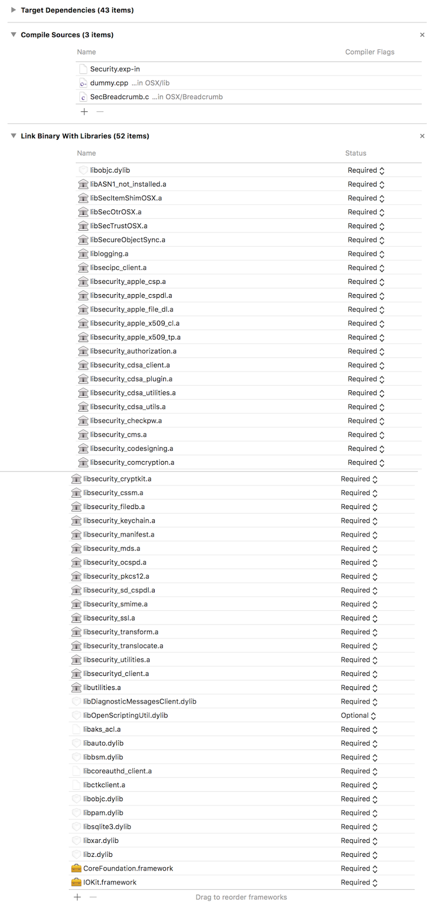

<!-- truncate -->

## Background

`Security.framework` provides many public APIs, including those for authentication, authorization, the keychain, codesigning, and cryptography. It is open source, included in every release for macOS on [Apple Open Source](https://opensource.apple.com/). Covered by the Apple Open Source License, we are able to include it in the Darling source tree and distribute it. While the majority of projects on AOS are from BSD (with Apple's own modifications), a good deal of system frameworks are there for us to include in Darling, such as WebKit, WebCore, JavaScriptCore, Heimdal, and SmartCardServices. Using Apple's own code wherever possible is the fastest way to 100% compatibility. While Apple is still no champion of FLOSS by any means, this is a privilege we have that the WINE project does not because Microsoft makes far less of their code open source. Security dispatches it's cryptography routines to CoreCrypto and CoreTLS (which also uses CoreCrypto). Both are sublibraries of `libsystem`. The original source of CoreTLS is APSL licensed and currently part of Darling. The source code of CoreCrypto is available from Apple's website but it is released under a license that doesn't permit redistribution and requires you to delete it after 90 days, to name a few conditions. As a result, Darling has a few CoreCrypto functions reimplemented and the rest have stubs. Building it is not as simple as the simple `./configure && make && sudo make install` that we sometimes take for granted. Security uses the proprietary Xcode as a build system. In order to make Security part of Darling, we had to observe as best we could how it is built by Xcode and reproduce the setup using CMake (Darling's build system of choice).

<figure>

  
  <figcaption>A screenshot of all the libraries that Security links to in Xcode. Some are static libraries that make up the source code of Security, some are shared libraries, and others are frameworks.</figcaption>

</figure>

## Lessons Learned

### Just because it's Apple's code doesn't mean it's necessarily all good

Security's source code was full of incorrectly capitalized header names. This is because macOS defaults to using Case-Insensitive HFS+ by default, causing these problems to not be noticed until we tried building the source when it is on EXT4, a case-sensitive filesystem. Few people chose the case-sensitive variant of HFS+ and many software suites, including some by Adobe, flat-out refuse to be installed to case-sensitive HFS+. When APFS was announced to be the default filesystem of the upcoming macOS 10.13 High Sierra, we are very disappointed that it will still be case-insensitive by default. This problem confirms that Apple uses case-insensitive filesystems for development.

### Crazy setups might exist for a hidden reason

In this case, it was a bad reason. When we finished getting all the static libraries in Security to build and went to have them be linked together, a confusing issue manifested: the link failed due to duplicate symbols. We double and triple checked the macros, compile flags, and source file lists, yet despite having the same exact setup as what was in Xcode the issue remained. Later on, it was discovered that this is caused by Dead Symbol Stripping being enabled by default in Xcode and Security literally won't link without it. It was initially overlooked because only manually specified compile options in Xcode were copied over, and it was assumed that all the necessary defaults in Xcode would be the same as what `clang` and Apple's linker `ld64` also default to.

### Sometimes it is better to start over

We originally started out with `Security-57337.20.44`, a version of the framework from Mac OS X 10.11.3. This version turned out to be more difficult to build than the latest from macOS 10.12.4 (`Security-57740.51.3`) because some time between those releases, Apple refactored Security to use less individual Xcode Project files, resulting in us only having to dig through a few instead of one per sub-library. This newer version also made less use of macros. Combined, these factors made it easier to create a build system for the newer version of Security.
