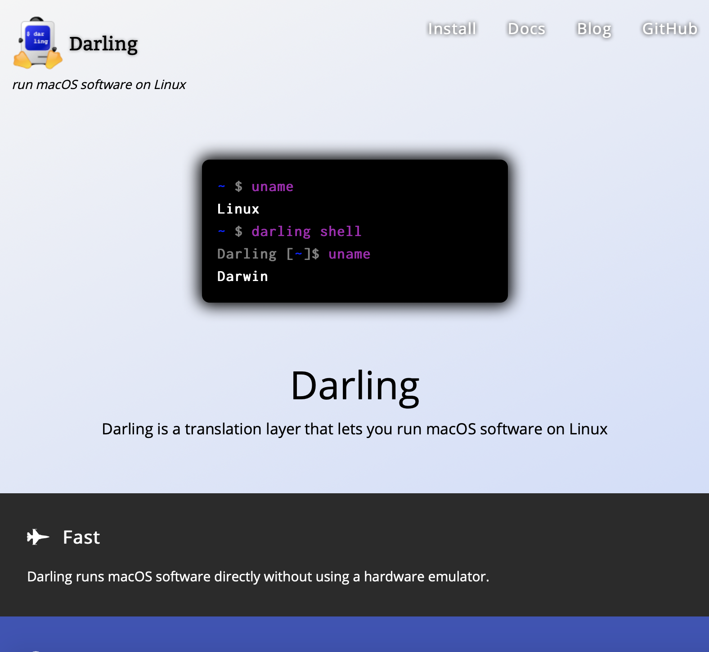
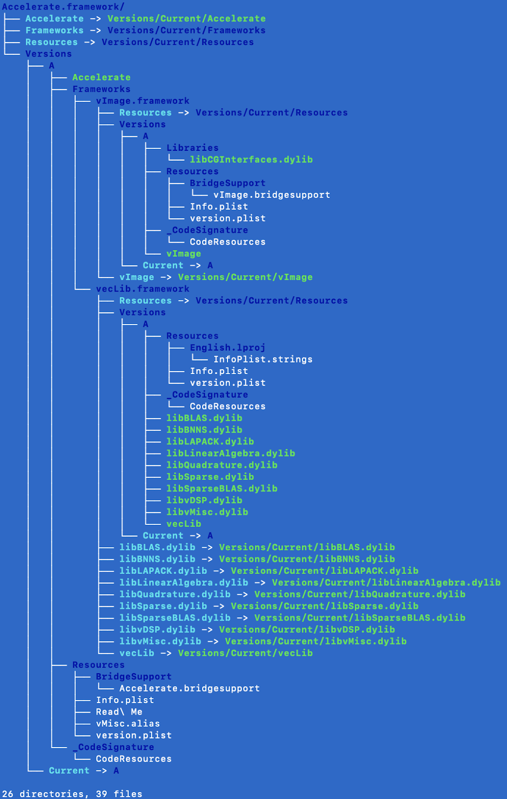

We are very excited to say that in Q2 2019 (April 1 to June 30) we saw more community involvement than ever before. Many pull requests were submitted that spanned from bug fixes for our low level assembly to higher level modules such as the AppKit framework. Thanks to everyone for your contributions and we hope for this level of engagement to continue.

<!-- truncate -->

## Darling Community Discord

While we have relied solely on GitHub issues for a long time, it has become apparent that a platform for people to ask general questions, share knowledge, and coordinate efforts is necessary. There is now an official Discord server that is open for everybody to join in order to discuss anything Darling related. Here is the invite link: https://discord.gg/XRD3mQA. Feel free to join and invite anyone who may be interested!

## Darling Core

The community submitted more pull requests than we have ever received before in Q2.

[James Urquhart](https://github.com/jamesu)'s pull requests gave us more stubs for many frameworks including DrawSprocket, AGL, Carbon, CoreServices, and ApplicationServices. Wow, what a list, thank you James! James also fixed a very low level bug where system calls with large numbers of arguments wouldn't work properly for 32-bit applications. Finally, he fixed a problem where Darling was using `clock_sleep` instead of `clock_nanosleep` and a bug with the `stat` system call.

Commits sent in by [kamillys](https://github.com/kamillys) gave us more stubs for the AddressBook and Carbon frameworks.

## New Website

[Sergey](https://github.com/bugaevc) has remade [our project website](https://www.darlinghq.org/) using Hugo. This new website looks very modern and adapts for mobile devices. This refresh looks very snazzy! The Frequently Asked Questions section of the site is perfectly placed to answer some of the most commonly sought after information. The whole page has the right balance of content without overwhelming the viewer with technical details. The new site also highlights the key features and goals of Darling, including "Fast, Free, Compatible, Easy to Use, and Native."

<figure>

  
  <figcaption>A screenshot of the updated project website.</figcaption>

</figure>

## AppKit

Continued improvements were seen with our implementation of AppKit. Sergey squashed some bugs including crashing when no spelling engines were present and pointers having the wrong printing format. He got the X11 pasteboard to work with our AppKit. Ctrl+C/Ctrl+V away, even pretend it's Command if you want!

GitHub user [kamillys](https://github.com/kamillys) also submitted a PR which gave AppKit more stubs for NSApplication and NSWorkspace.

AppKit also now also reexports ApplicationServices, solving some crashes due to undefined symbols when programs were being loaded.

## Nested Frameworks

Some frameworks on macOS appear to be just one framework but under the hood are made up of sub-frameworks which are usually reexported so that when being linked to it appears to be one big framework. Until now, our build system didn't support nested frameworks. In June, [Andrew](https://github.com/ahyattdev) added support for this and system frameworks such as Accelerate now have the same file structure as they do on macOS. This was accomplished using some CMake magic and carefully replicating the structure of some system frameworks.

### Framework Nesting vs. Reexporting

Reexporting is when a dynamic library presents itself as also containing the symbols of the library or framework it is reexporting. Symbols are typically functions, constants, or classes. This is why you can link to only AppKit and without linking to Foundation you can use Foundation symbols. Nested frameworks are when one framework is placed inside the other. In the case where a larger framework is broken into sub-frameworks (like CoreServices and ApplicationServices) you need to have the parent framework reexport those sub-frameworks in order to appear as one framework. Another use case for nesting frameworks is when your framework relies on a supporting library and it's only meant to be used by your framework. This is like keeping it private. In that case the parent framework wouldn't reexport it but it would instead link to its child framework.

<figure>

  
  <figcaption>A tree view of the framework structure of some of the frameworks that were fixed.</figcaption>

</figure>

## Foundation

A good amount of attention was received by Foundation this time. Our `NSKeyedArchiver`/`NSKeyedUnarchiver` had many bug fixes and improvements submitted by [CuriousTommy](https://github.com/CuriousTommy). Stability in this area very important because `NSKeyedArchiver` is used to serialize objects extensively in almost every Cocoa application. In addition to those improvements, Tommy gave Foundation symbols for the `NSScriptClassDefinition` category of `NSObject` and fixed an issue with some some macros in `NSObjCRuntime.h`.

Stubs were also added by [kamillys](https://github.com/kamillys) for `NSScriptClassDescription` and for some `NSCallbacks` functions that Foundation was missing.

These changes improve the general compatibility because as the name implies, Foundation is very fundamental and relied on by many other libraries and applications.

## CoreFoundation

Error handling in NSSet was [improved by Tommy](https://github.com/darlinghq/darling-corefoundation/pull/1/files) by better checking parameters, particularly if someone tries to insert a `nil` object into a set, which isn't supposed to be possible but was possible before. Thanks Tommy!

## Going Forward

Strong community involvement is always exciting and motivating. We received lots of feedback and pull requests! If you have any questions about ways you can contribute and learn, join our Discord linked at the top of this post. When first trying to help out an open source project it may seem unclear how you can help. If none of the [open issues on GitHub](https://github.com/darlinghq/darling/issues) jump out of you, the Discord is the perfect place to ask where you can start. The [wiki](https://wiki.darlinghq.org/start) also is very useful because it contains build instructions and workarounds for known build problems.

:::info Time-traveler's Note

The wiki has been converted into the [docs](https://docs.darlinghq.org/).

:::

It was also nice to see the community step up and fix some 32-bit specific bugs because as anticipated in the last progress report, the release of macOS coming in a few months drops all support for 32-bit applications. Darling plans to continue supporting 32-bit applications for a long time and once GUI support improves it will be a strong option for applications that stop working due to the lack of 32-bit capabilities.
