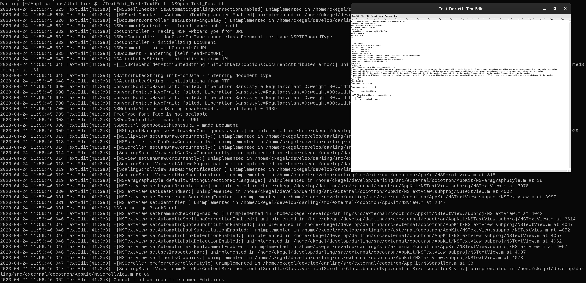
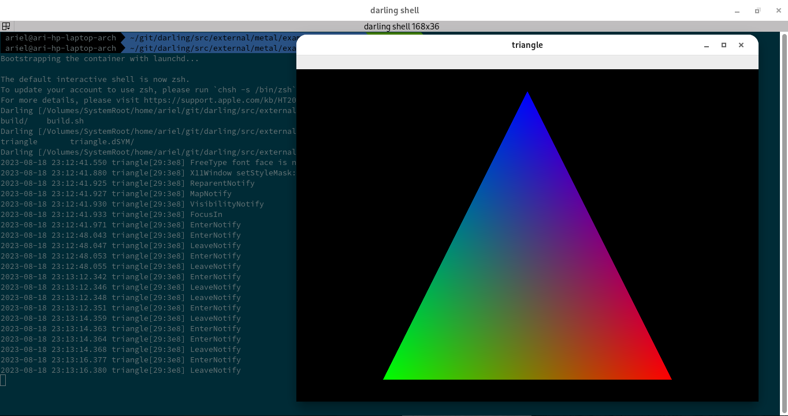
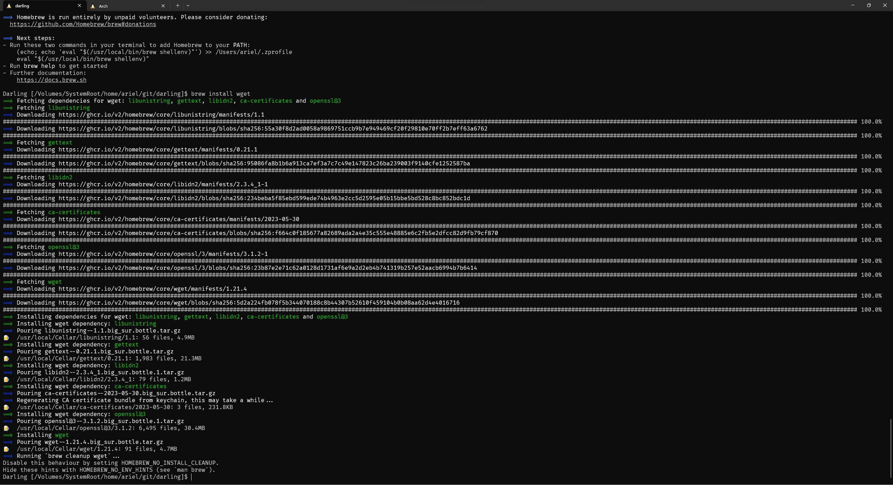

It's been a while since our last post (4 years!) but we're finally back with another progress report. The past few years have been an exciting time for Darling with lots of changes happening in the lower levels, numerous bugs getting fixed, and many stubs being added. All these changes have been made with one goal in mind: a better experience for users. We have plans for further improvements, which we hope will make easier to use Darling and improve compatibility.

<!-- truncate -->

## Updated Blog

Our original blog was hosted on Blogger, but by mid-2023, it was looking pretty outdated and had many spam comments. So, as you can see (since you're here), [Ariel][facekapow] remade the blog with [Docusaurus](https://docusaurus.io/). This new engine allows us to write blog posts in Markdown and produces a static site that can be deployed to hosting providers like GitHub Pages. You can find the source for the new blog [here](https://github.com/darlinghq/blog).

The new blog also comes with a new comment system powered by [Giscus](https://giscus.app/) which stores all comments in GitHub Discussions on the main Darling repo. This should make moderation easier and also engage users that see the discussion directly on GitHub in addition to those on the blog website.

Expect more blog posts on the new blog soon. :wink:

## Wiki Converted to Docs

If you knew about Darling back in 2019, you might've seen the wiki in action. It had instructions on how to build Darling, what to try, and some info on the internals of Darling and macOS. Well, in early 2020 (around April), [Luboš][LubosD] converted the wiki into the docs using [mdBook](https://github.com/rust-lang/mdBook). This new system accepts documentation as Markdown and produces a minimal static site specifically tailored for documentation.

Additionally, with the old wiki, only registered users could edit the wiki. With the new docs, because it's in [a repo on GitHub](https://github.com/darlinghq/darling-docs), anyone can contribute to the documentation&mdash;and many have already done so! At the time of writing, 20 users have contributed to the docs and there's been a total of 181 commits on the repo. If you think you can improve the docs in some way (even just a spelling or grammar fix), please feel free to open a pull request and do so!

## New Project Members

2020 saw the introduction of two new members to the Darling team: [Tommy][CuriousTommy] and [Ariel][facekapow]. We're excited to see the Darling team grow and glad to have them on board! How about a brief introduction from each of them?

### Thomas

> Hello everyone, my name is Thomas! In my day job, I work as a backend software developer. Outside of work, I love playing video games and contributing to open source projects. I was first introduced to Darling when I watched Wendell talk about it in “The Tek” podcast. I always had an appreciation for software preservation. The potential Darling has for preserving legacy macOS software got me really interested in the project.
>
> One of my current goals is to get Darling working on Linux ARM64, with Apple Silicon devices being the primary focus. This will allow me to test Darling on my M1 Pro, Macbook Pro. In the future, I want to work on getting some video games working within Darling. I also want to explore how macOS allows native iOS apps to run on Apple Silicon devices and replicate it in Darling.
>
> While I may not be as knowledgeable compared to the other project members, I enjoy working on Darling and gaining a deeper understanding on how macOS works under the hood.

### Ariel

> Hey there, I'm Ariel! I'm a computer science student working on my bachelor's. I originally came across Darling while trying to run a server for an iOS/Android game called The Blockheads and found the server software was only available for macOS. Of course, I tried running it under Darling and it didn't work, but I knew that this was the best option to try to get it running.
>
> I decided to poke around in Darling's issues to try to get my feet wet and familiarize myself with the codebase. In the process, I got sidetracked and started trying to get Homebrew running. From there, I started hacking on different parts of Darling until I got it working, and I've been hacking away at different parts ever since then.
>
> At the moment, I'm working on trying to get xcodebuild to successfully build a project and (on the back-burner) getting Darling to run without needing superuser privileges.

## Goodbye, LKM!

The biggest and most notable change with Darling in the past few years took place in 2022: dropping the Linux kernel module. This change allows Darling to run entirely in userspace, which makes for a much more comfortable experience for developers and users of Darling alike. Gone are the days of random kernel panics/freezes due to something misbehaving in Darling.

This change&mdash;developed primarily by [Ariel][facekapow]&mdash;introduced darlingserver, a userspace kernel server for Darling (à la wineserver for Wine). A more detailed post explaining how it works is planned, but essentially it does the same things the LKM did (handling Mach IPC and psynch calls, among others) except it does it all in userspace by setting up a Unix RPC socket that all processes in the container connect to in order to talk to darlingserver. Certain aspects were trickier to implement (signal handling and kernel-side sleeping in particular), but they *were* implemented and darlingserver reached feature parity with the LKM and was merged.

Being free from a kernel module allows Darling to support many more use cases and environments, and we already have some ideas on how to improve that even more (more on that in [The Future](#the-future)).

## Stubs Galore

Over the past few years, many users have contributed lots of stubs. Stubs allow apps to progress further when they don't strictly need the functionality these frameworks provide.

  * [Andrew][ahyattdev] added stubs for many frameworks and libraries, including VideoToolbox, QTKit, AudioUnit, CoreMediaIO, and many more
  * [Tommy][CuriousTommy] added stubs for many frameworks and libraries, including MetalKit, SystemConfiguration, ModelIO, Metal, and many more
  * [Cassiano Vailati][cassvail] added stubs for CoreLocation
  * [Luboš][LubosD] added stubs to AppKit, AudioToolbox, and CoreServices
  * [Ariel][facekapow] added stubs for many frameworks and libraries, including SystemConfiguration, AppleSauce, CoreAnalytics, libsystem_kernel, and many more
  * [Hin-Tak Leung][HinTak] added stubs to ATS, CoreServices, IOSurface, and SystemConfiguration
  * [JCWasmx86][JCWasmx86] added stubs for CloudKit
  * [Zach Wolfe][zachwolfe] added stubs for AssertionServices, libMobileGestalt
  * [Marco Rolappe][mrolappe] added stubs for many frameworks and libraries, including Automator, CalendarStore, Collaboration, CoreAudioKit, and many more
  * [Daníel Grétarsson][dingari] added stubs to CoreAudio, AudioToolbox, ImageIO, and CoreServices

As always, more stub contributions are helpful and always welcome! If you'd like to generate stubs for some new frameworks or libraries, there's [a guide](https://docs.darlinghq.org/contributing/generating-stubs.html) in our docs on how to do so.

:::note

At the time of writing, this guide only works on macOS 10.15 or below. This is because newer versions of macOS rely on a *shared cache* where all system libraries and frameworks are bundled into one binary. We're working on a tool that can generate stubs using the information from the shared cache.

:::

## Apple Open-Source Code Updates

Apple open-sources most of their low-level libraries and components like XNU, libSystem, and even the Security framework&mdash;essentially, they open-source most of the core system (Darwin). Notably, Apple does *not* open-source higher-level libraries and frameworks like AppKit or even Foundation, so we *do* have to reimplement those ourselves, sometimes by building on existing work, like in the case of AppKit (Cocotron) and Foundation (Apportable). However, we can still take advantage of the open-source code and avoid having to reimplement those low-level libraries ourselves. Apple typically publishes new releases of this open-source code some time after a new release of macOS.

Over the last 4 years, Darling has gone through, not one, but *two* updates to nearly all the Apple open-source code we use. The first update was started around mid-2020 by [Ariel][facekapow] and completed in February 2021. This update started because we were having issues building Apple's code on newer versions of Clang and we noticed these problems were fixed in newer versions of Apple's code. This update brought Darling on par with macOS 10.15 in terms of the open-source code used and included with it a few changes in Darling's build system and kqueue implementation.

The second update was started around March 2022 by [Tommy][CuriousTommy] and completed around May 2023. It was started because of Tommy's work on ARM support in Darling; he noticed that Apple's updated code had improved support for ARM (since that code was now being used on Apple Silicon). This update brought Darling on par with macOS 11.5 in terms of the open-source code used (which, again, doesn't include higher-level frameworks like AppKit) and brought with it changes to how Darling's code is organized, as well as changes to the build system and packaging (more on that later).

So where are we now after these updates? Well, our open-source code from Apple (i.e. for low-level libraries) is now on par with macOS 11.5, so the updated functions and APIs from this open-source code are now available in Darling. Additionally, the updated code has much better ARM support, so this should make it easier to add ARM support to Darling in the future. Plus, in the last source update, Tommy added documentation for most of the Apple open-source code on how to update each of them. This should help with future source updates and hopefully make them easier to complete.

## Build System Improvements

As you may or may not know, Darling is a *large* codebase and a large codebase like ours requires a good build system like CMake. Of course, CMake is only half the equation; the other half of the equation is all the scripts, functions, and `CMakeLists.txt` that we write to build our code. Given Darling's current state (where most users have to compile it themselves), having a good, ergonomic build system that allows users to easily build Darling is key. Additionally, our build system should also be easy to develop with, especially to make easier for new contributors.

In these past few years, Darling's build system has seen numerous improvements, both on the user side and the developer side. For instance, [Andrew][ahyattdev] added an option to the build that made it possible for users to build Darling only for certain architectures (e.g. only x86_64). By default, Darling still builds with both 32-bit and 64-bit support, but this option is particularly useful for distros that don't have multilib support (or ones where it's not easy to enable) and thus can't run 32-bit code. Andrew also added support for uninstalling Darling via a script in `tools/uninstall`.

[TheBrokenRail][TheBrokenRail] fixed a number of bugs in the build system and gave the Debian packaging an overhaul (including adding automatic detection of dependencies in elfloader-wrapped libraries); he also added fixes to Darling's CI build on GitHub Actions.

[Sergey][bugaevc] also fixed a few issues with Darling's build system that were causing some of our libraries to be incompatible with their real macOS counterparts; in particular, we weren't building libc++ properly, leading to symbol conflicts. Sergey also updated many more libraries to build properly with the two-level namespace, which allows us to more accurately match macOS's behavior. These changes (along with some other fixes added by Sergey and Ariel) allow more software to run, such as [ClickHouse DB](https://github.com/ClickHouse/ClickHouse).

### Modular Build

Darling used to be built as one single package with every single library and framework required to be built with it. This also means that all the dependencies for all frameworks and libraries were required to be installed as well. So even if you only wanted to use Darling on the CLI (maybe to use the Xcode CLI tools, for example), you had to install all the dependencies for the GUI components as well.

Fortunately, that all changed in early 2023 when [Ariel][facekapow] modularized the build. You can now choose which components of Darling you'd like to build and install via a CMake configuration option (see [the documentation](https://docs.darlinghq.org/build-instructions.html#building-only-certain-components)), which allows you to avoid installing dependencies for other components and also reduce the size of the installation. Additionally, these changes *also* carry over into the binary packages produced for Darling: you can install individual components via separate Debian or RPM packages. With these updates to how Darling is built and installed, we got to thinking about more ways the install process could be simplified for users and came up with something that would greatly simplify the process for most users&mdash;more on that in [The Future](#the-future).

## vchroot

Back in [our progress report for Q1 2019](../../../../2019/05/03/progress-report-q1-2019/index.md), we mentioned that [Luboš][LubosD] was working on a replacement for the old filesystem virtualization system. This replacement, called vchroot ("virtual chroot"), was completed and merged in February 2020. What does this do for us? Well, it allows us to provide Mach-O code within the container with the same filesystem view it previously had while allowing native ELF code to access the host filesystem as it normally would. That's where the "virtual" part of "virtual chroot" comes from: we perform the equivalent of a chroot for the Darwin code (in libsystem_kernel), but this isn't an actual chroot, so it doesn't affect non-Darwin code.

Importantly, this allows GUI apps to work with absolutely no workarounds! There are no configuration files or sockets that need to be made available in the container. Our code can seamlessly load host libraries (via the method described [here](https://docs.darlinghq.org/internals/calling-host-system-apis.html)) and these host libraries, in turn, can load their own libraries and configuration files and connect to sockets as they normally would.

This filesystem virtualization system also opens up more possibilities: we are now handling path translation between the prefix and the host filesystem ourselves; what if there's more that we could do ourselves? Say, for example, the filesystem overlay (i.e. overlayfs)? We've been thinking about that and have some work in-progress to do so (more on that in [The Future](#the-future)).

## GUI Support Advancements

macOS has some great CLI programs and tools (especially for developers), but of course, the main thing macOS is known for is its collection of great GUI apps. While Darling is still a long way from being able to run many popular apps&mdash;including Logic Pro, Garageband, and Xcode, to name a few&mdash;we *have* made some notable advancements in our GUI support these past few years.

### Foundation

The Foundation framework isn't exclusively used for GUI programs, but it's a *foundational* framework that the higher-level GUI frameworks build upon. This time around, Foundation saw many improvements, new implementations, and bug fixes.

[Luboš][LubosD] fixed a couple bugs (including support for ARC code), implemented and stubbed methods on some classes (e.g. `NSTimer` and `NSAppleEventManager`), and implemented support for `NSUnarchiver`. This class is used by some older apps to do the same as `NSKeyedUnarchiver`, except that it does not use keys to decode objects; instead, the objects are decoded based on the order of the decoding calls.

[Sergey][bugaevc] implemented support for `NSPort`s and fixed a few bugs around coding (as in encoding/decoding), `NSMethodSignature`, and `NSInvocation`, as well as a correction to the return value of `-[NSRunLoop runMode:beforeDate:]`; this return value is used by callers to know whether they should continue to run the loop. He also started some work on NSXPC, the higher-level interface for libxpc that allows processes to communicate.

Most notably, though, Sergey implemented [Distributed Objects](https://developer.apple.com/library/archive/documentation/Cocoa/Conceptual/DistrObjects/DistrObjects.html) support (we also have some docs on the [internal structure of DO](https://docs.darlinghq.org/internals/macos-specifics/distributed-objects.html) and a [brief example](https://docs.darlinghq.org/internals/macos-specifics/mach-ports.html#distributed-objects)). Sergey's implementation is actually protocol-compatible with Apple's implementation (meaning they're capable of communicating with each other). Distributed Objects are comparable to NSXPC in that they allow processes to communicate with each other (even over a network!). However, the way they do so and the interfaces they provide for doing so are quite different. NSXPC defaults to serializing everything across the connection except for select objects that can be proxied. Additionally, all methods must return void and are always executed asynchronously; if they want to return values, they must do so via reply blocks. Distributed Objects, on the other hand, proxy most objects and only serialize a select few classes, are synchronous by default, and have no restrictions on the interfaces they can provide. Distributed Objects have been deprecated (in favor of NSXPC), but we still need to support them for older applications that use them.

[Tommy][CuriousTommy] added a few stub methods to existing classes (e.g. in `NSData`) and fixed where a few symbols are defined (some symbols needed to live in CFNetwork, not Foundation). Tommy also fixed some warnings that newer versions of Clang had turned into errors, preventing Darling from being able to build with those versions of Clang.

[Ariel][facekapow] added many fixes and stubs, implemented a basic version of `filecoordinationd` (needed by Xcode/`xcodebuild` via NSFileCoordinator), and implemented a few new methods and classes. More importantly, he also built on the initial NSXPC work done by Sergey and finished the implementation of NSXPC. Like our implementation of Distributed Objects, our NSXPC implementation uses the same protocol as macOS and is technically capable of interoperating with it. The biggest thing missing for NSXPC (and XPC in general) is now `launchd` support for XPC per-application domains; this is what makes it possible for applications to launch private XPC services that the rest of the system can't use.

As part of their cleanup and formatting changes for Cocotron, [TheBrokenRail][TheBrokenRail] also moved some code from Cocotron to Foundation (where it belongs).

In an effort to get the Blockheads Server (a macOS-exclusive server for the mobile game The Blockheads) up and running, [Juan Patricio][juanmuscaria] implemented encoding for `NSData` and `NSIndexSet`, decoding for `NSIndexSet`, and added a decoding stub for `NSLayoutConstraint`.

### Cocotron

Of course, no discussion about Darling's GUI support would be complete without the Cocotron, the subproject that implements most of our higher-level GUI frameworks like AppKit, QuartzCore, and more. Cocotron has seen quite a number of improvements and fixes these past few years from quite a few contributors, as well!

[Luboš][LubosD] implemented *many* methods and fixes (too many to include here!), but the most notable ones are fixes to get basic SDL input working, loads of unkeyed coding support in many AppKit classes, support for XIM (allowing composed characters), and much more. Luboš also started some work on [redesigning the backend](https://github.com/darlinghq/darling/issues/937) to mirror the way it works on macOS. Additionally, Luboš added some optimizations to Cocotron that allow it to handle menu items faster.

[Sergey][bugaevc] added some fixes for the way we report our windows to X11 (to help window managers manage them properly) and fixed the way we draw clipping paths when producing PDFs. Sergey also updated large portions of the code to use correct types (e.g. `NSInteger`/`NSUInteger`, string typedefs, enums, etc.) where appropriate and did a huge manual reformatting of the code.

[Tommy][CuriousTommy] added many stubs, including stubs needed by iTerm 2, WeChat, and glut, among others. As he did in Foundation, Tommy also fixed some warnings that had become errors with newer releases of Clang; thanks to these updates (and corresponding updates in many other parts of our codebase), Darling was once again buildable with those versions of Clang.

[Ding Fei][danix800] [contributed a fix](https://github.com/darlinghq/darling-cocotron/pull/6) to our CMake code for detecting required libraries, preventing users from getting erroneous messages of missing `libxkbfile` when they really weren't.

Shortly thereafter, [r-wilbur][r-wilbur] *also* contributed a fix for our `libxkbfile` CMake code: a fix for the message contents display when missing the library. r-wilbur also noticed that we had misspelled the macro name for the `libxkbfile` include path, so they decided to [fix](https://github.com/darlinghq/darling-cocotron/pull/11) that.

[TheBrokenRail][TheBrokenRail] [contributed](https://github.com/darlinghq/darling-cocotron/pulls?q=is%3Apr+is%3Amerged+author%3ATheBrokenRail) multiple fixes, missing APIs (including some APIs for modal sheets), and constants. As mentioned earlier in [Foundation](#foundation), TheBrokenRail also did a major cleanup and reformatting to the Cocotron codebase, and even added clang-format integration to keep the codebase tidy in the future!

[Ariel][facekapow] fixed an issue with window rendering that was preventing the OpenGL sample app from rendering its contents in a loop. He also added a few stubs and constants needed by `xcodebuild`, the CLI program for building Xcode projects.

[Juan Patricio][juanmuscaria] added some implementations for `NSMenu` methods that we were missing as well as another missing method and some fixes for `NSAlert`. As mentioned earlier, these fixes were part of his effort to get the Blockheads Server app running in Darling. Thanks to his efforts, that app no longer crashes and actually manages to start the server!

[Daníel Grétarsson][dingari] added some missing stubs and constants in AppKit, CoreText, and CoreGraphics. [Andrew][ahyattdev] also added some missing stubs and constants to various Cocotron frameworks and fixed an issue with including CoreGraphics headers in plain C code.

At the time of writing, [Christian][CKegel] has a PR for AppKit currently under-review that adds many missing implementations, stubs, and constants needed to get Apple's TextEdit app from the older released code samples running. They've actually gotten it to run and work for the most part! Here's a little sneak peek:

<figure>

  
  <figcaption>A screenshot of Apple's TextEdit running under Darling.</figcaption>

</figure>

### Initial Metal Support

In December 2022, [Ariel][facekapow], who had previously never worked with graphics at all, decided to throw himself into the deep end and start working on a Metal implementation for Darling on top of Vulkan. Building on work started by [Ella Stanforth][Ella-0], Ariel started working on Indium and Iridium.

Indium translates Metal API calls to their Vulkan equivalents. Although both APIs take the modern approach of giving explicit control over the hardware to developers, they implement slightly different pipelines, so this is not so simple to do. Additionally, Metal implements a more flexible pipeline than Vulkan (meaning that it allows you to dynamically change more properties) and by default also does automatic dependency tracking and synchronization for resources used in the pipeline, neither of which Vulkan does (meaning Indium has to do it).

Iridium is a subproject of Indium which translates Metal shaders (in the AIR format) to SPIR-V (the format required by Vulkan). This involves translating both the bitcode itself (i.e. the instructions contained within the shader) as well as the interface/API that the shader expects.

At the time of writing, Darling's Metal implementation (which is essentially a thin Objective-C wrapper over Indium) is able to successfully run very basic Metal programs, including the first few samples from [Metal by Example](https://github.com/metal-by-example/sample-code).

<figure>

  
  <figcaption>A screenshot of Apple's "Using a Render Pipeline to Render Primitives" sample running under Darling.</figcaption>

</figure>

:::note

Due to some updates to LLVM's API, Iridium no longer works with the latest version of LLVM (LLVM 15 at time of writing). Iridium *can* be updated to work with these changes, but it will require some changes to how we handle pointers internally.

:::

## Debugging Improvements

As you can imagine, when developing Darling, we often have to trace and debug programs to figure out why they're not working properly. We employ a variety of different methods to do so; in a pinch, even the classic method of print debugging can work. Thankfully, we have access to better debugging tools within Darling, and this is something we've also improved over the last few years.

### xtrace

[xtrace](https://docs.darlinghq.org/contributing/debugging.html#xtrace) (our strace-like tool for debugging Darwin syscalls made into libsystem_kernel) got a major overhaul from [Sergey][bugaevc] in early 2020. Among other things, he enabled xtrace to print syscall arguments (often with their symbolic names), added color to the output, and added [MIG](https://docs.darlinghq.org/internals/macos-specifics/mach-ports.html#mig) routine tracing.

But wait, there's more! Later that year, [Ariel][facekapow] updated xtrace to support multi-threaded programs. A couple years later (in 2022), he updated xtrace again, this time to allow output to be printed to thread-specific logs (avoiding the usual jumbled output produced by multi-threaded programs), and to print more descriptive call-specific details for a number of calls (including `posix_spawn`, `select`, `execve`, and the `kevent` family of calls). Additionally, he also added support for tracing 32-bit programs.

### LLDB

Of course, often the best tool for tracking down bugs is a debugger. Back when we first started using a userspace binary loader (the first time, before the LKM), we had a debugger based off of [modified GDB sources](https://github.com/darlinghq/darling-gdb). When we transitioned to an in-kernel binary loader with the LKM, however, this debugger was no longer usable since Darling no longer used mldr to launch executables.

:::note

Now that now that Darling uses mldr again, it would technically be possible to use this modified version of GDB again (with a few tweaks due to mldr requiring some help finding darlingserver).

:::

That's why, back in 2020, [Luboš][LubosD] implemented the APIs and behaviors required by LLDB. This was certainly no small feat, given that LLDB makes use of many Mach APIs related to tasks, threads, memory (VM), and exceptions. Most of the changes required were due to the fact that the necessary information needs to be kept in the kernel (back then, in the LKM; nowadays, in darlingserver) so that the Mach debugging-related APIs that LLDB needs can provide said information to it. Because of this, Luboš had to add some code in libsystem_kernel for intercepting signals and redirecting them to the LKM (and later, to darlingserver). Additionally, he had to add special behavior for `SIGSTOP`; because the process itself needs to remain running in order to service requests from the kernel for certain debug info, Darling reserves a real-time (RT) signal to notify the process it needs to emulate the behavior of `SIGSTOP` and inform the kernel of its current state. Thanks to this, Darling now has a proper debugger, which makes hunting down bugs in our implementations much easier!

## Initial CoreAudio Support

Audio is a core part of the user experience on any desktop, and macOS is no exception. Around March 2020, [Luboš][LubosD] got to work implementing macOS's audio frameworks and made some good progress, getting far enough to even build the command-line tools `auplay`, `auinfo`, `aurecord`, and `auconvert`.

## HTTPS Support and Homebrew

Way back in early 2020, [Ariel][facekapow] made his first contributions to the project by trying to get Homebrew, the well-known macOS package manager, up and running within Darling. In order to do this, he had to implement quite a few functions in corecrypto (Apple's low-level cryptography library) and update Darling's SSL certificates and add a script to generate a certificate bundle. The system's certificate bundle is used by the Security framework (specifically: by the `trustd` daemon) to verify server-provided certificates in connections.

After these and a few other fixes related to vchroot and missing argument implementations for some commands, Darling can now finally run macOS's de-facto package manager, Homebrew, and successfully install many formulae! Notably, many Casks are not yet working due to either missing options in some commands or missing support for APFS DMGs in darling-dmg.

<figure>

  
  <figcaption>A screenshot of Homebrew installing wget.</figcaption>

</figure>

## Miscellaneous Bug Fixes and Improvements

### 2020

In early 2020, [Luboš][LubosD] added a slew of bug fixes and improvements to the lower-level components of Darling. These included things like fixing syscall return values, implementing more of FSEvents, installing more missing binaries (e.g. `xattr`), implementing more sysctls, fixes to allow various applications to progress further, and many, many more. One of these fixes also enabled JRE 8's HotSpot VM to work within Darling! Luboš also started working on an implementation of `iokitd` with the goal of enabling IOKit within Darling; note that you won't find an `iokitd` on macOS, since IOKit calls are handled by the kernel there.

Around the same time, [Andrew][ahyattdev] also contributed some fixes and improvements, including initial support for macOS's `open` command, fixes for LaunchServices, and many missing symbol stubs. Meanwhile, [Török Bálint][Balint66] implemented a few `sysctl`s (under `machdep.cpu`) required by the Dart VM, enabling basic Dart apps to run under Darling. Finally, [Ariel][facekapow] fixed some issues in `libsystem_kernel` with vchrooting that fixed the Ruby VM in Darling; this was part of the work necessary to enable [Homebrew](https://brew.sh) to run under Darling.

### 2021

[Benjamin Moody][bemoody] [corrected](https://github.com/darlinghq/darling/pull/906) the way we escape arguments to `darling shell` so that quoted string will be properly passed through. [Luboš][LubosD] also added some more fixes; this time for locales in libc, some missing functionality in NSTimer, and support for importing global variables from ELF libraries in `wrap_elf`. Later that year, [Trung Nguyen][trungnt2910] [contributed some fixes](https://github.com/darlinghq/darling/pull/1062) to libsystem_kernel that allow the `dotnet` command (for the .NET Core SDK) to work for simple programs.

Around April, [Ariel][facekapow] decided that he'd had enough of the old libxpc code based on NextBSD's libxpc; that code was very buggy (especially when it came to connections) and didn't implement the actual XPC wire format, so Ariel rewrote the libxpc code with the specific goal of implementing connections properly (on top of libdispatch) to have reliable cross-process communication.

### 2022

[Ray Redondo][rdrpenguin04] [added](https://github.com/darlinghq/darling/pull/1186) an implementation of `mach_vm_msync`, a Mach RPC call that allows processes to ask the kernel to flush or discard memory (according to the given flags); this fixed an issue Ray was running into with a Rust program, but in general, this addressed `msync` causing darlingserver to abort.

Now that darlingserver was in and the LKM was out, [Trung][trungnt2910] wanted to try getting Darling working on WSL 1; a couple PR's later, they had managed to do it! While not officially supported (due to certain tricks that are necessary to allow Darling to run there), it *is* possible to run Darling on WSL 1 now!

In one of Darling's subprojects, darling-dmg, [Marco Rolappe][mrolappe] [added some fixes](https://github.com/darlinghq/darling-dmg/pull/99) for mounting certain types of disk images.

### 2023

In 2023, [Zhaofeng Li][zhaofengli] fixed ELF symbol address resolution in `wrapgen` (the binary used by the `wrap_elf` CMake function), made Python 2 an optional part of the build, and removed an unused CMake option left over from before the Mach-O transition; all together, these changes were part of their effort to [add Darling as a package for the Nix package manager](https://github.com/NixOS/nixpkgs/pull/227765).

Even after the darlingserver merge, we still kept the LKM repo around because we had some header files in there that other parts of Darling needed; after completing the 11.5 sources update, [Tommy][CuriousTommy] thought it was time to remove the LKM submodule altogether and move those headers to other submodules. After that, he also tackled the recent build break on newer systems (due to Clang 16 turning previous warnings into errors).

## The Future

As mentioned earlier, darlingserver makes it easier to both use and develop Darling. However, the bigger motivation was making it easier to *use* Darling. We'd like to continue improving the user experience in Darling wherever possible, which is why we have some work in-progress to completely get rid of privileges/SUID (currently still needed to mount the overlayfs). Furthermore, we're also considering getting rid of the overlayfs altogether, which would allow Darling prefixes to be located on filesystems not supported by overlayfs. This is particularly useful for users with encrypted home directories, since overlayfs does not support storing the upper layer on an encrypted filesystem like eCryptFS. Further in the future, we'd like to make it possible to run Darling within a Flatpak and maybe even allow it to be used as a Flatpak runtime for macOS apps. Getting rid of the kernel module also opens up more possibilities for supporting additional platforms such as Android.

[Tommy][CuriousTommy] is currently working on adding ARM support to Darling. This would allow us to run some newer macOS applications that are only built for ARM (due to Apple's move from Intel processors to Apple Silicon) and maybe even iOS apps in the future. For the time being, the goal is just to get apps running on their respective host platforms (i.e. ARM Darling on ARM hosts, x86 Darling on x86 hosts), but in the future, we'd also like to make it possible to run binaries with different architectures than the host. [Sergey][bugaevc] said it best in issue https://github.com/darlinghq/darling/issues/863#issuecomment-675834045:

> Darling will definitely continue &mdash; at least as a way to run x86_64 (or x86) binaries on x86_64 Linux systems. We also want to get arm64-on-arm64 binaries working (but not there yet).
>
> Then, there's emulation. We're not going to implement a complete emulation solution from scratch, so the potential Darling Rosetta would be based on an existing emulator &mdash; usermode QEMU. We've been envisioning a bright distant future where Darling is able to run binaries for either ppc/ppc64/x86/x64/arm64 on either of those architectures, using Darling Rosetta if the host and the program architecture don't match. But we're probably far away from that. Just arm64 on x64 is fairly possible though, but we have to get native arm64 on arm64 working first.

The modular build changes described earlier have made it more convenient to build and install Darling by choosing the components you want and only building and installing those. We'd like to go a step further: we currently have a CI that builds Debian and RPM packages for each commit; these packages are already split up into different per-component packages. Wouldn't it be great if you could easily install them? That's why there are plans to publish APT and RPM repos for the packages built by the CI, which would allow the vast majority of Darling's users to easily install and update Darling.

## Contributing

We know that Darling is a large codebase that can sometimes be daunting to contribute to, especially for newcomers. We'd like to make it easier for new contributors to improve Darling (even with small fixes or updates), so if you're interested, please let us know what you think would help you personally&mdash;it would probably also help others that would like to contribute! And of course, be sure to check out [our Discord](https://discord.gg/XRD3mQA); we have a `#learning` channel now where we're ready to help you get started with learning Objective-C, Cocoa, Mach, and other macOS internals, as well as contributing to Darling.

<!-- GH user links -->

[ahyattdev]: https://github.com/ahyattdev
[CuriousTommy]: https://github.com/CuriousTommy
[cassvail]: https://github.com/cassvail
[LubosD]: https://github.com/LubosD
[facekapow]: https://github.com/facekapow
[HinTak]: https://github.com/HinTak
[JCWasmx86]: https://github.com/JCWasmx86
[zachwolfe]: https://github.com/zachwolfe
[mrolappe]: https://github.com/mrolappe
[dingari]: https://github.com/dingari
[TheBrokenRail]: https://github.com/TheBrokenRail
[bugaevc]: https://github.com/bugaevc
[Balint66]: https://github.com/Balint66
[bemoody]: https://github.com/bemoody
[trungnt2910]: https://github.com/trungnt2910
[rdrpenguin04]: https://github.com/rdrpenguin04
[zhaofengli]: https://github.com/zhaofengli
[juanmuscaria]: https://github.com/juanmuscaria
[danix800]: https://github.com/danix800
[r-wilbur]: https://github.com/r-wilbur
[Ella-0]: https://github.com/Ella-0
[CKegel]: https://github.com/CKegel
